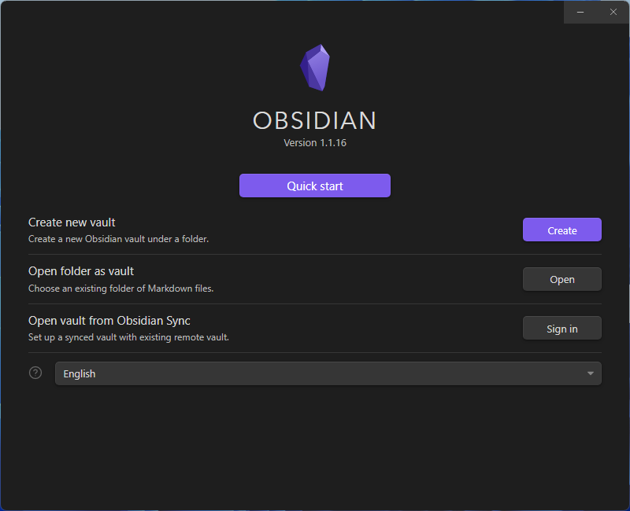
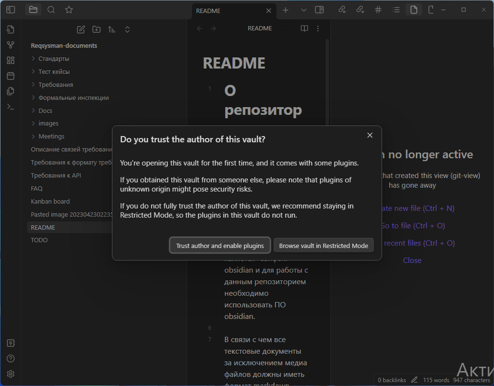

# О репозитории

Данный репозиторий содержит все текстовые артефакты используемые при разработке приложения Reqsysman

Этот репозиторий является "сейфом" obsidian и для работы с данным репозиторием необходимо использовать ПО obsidian.

В связи с чем все текстовые документы за исключением медиа файлов должны иметь формат markdown.

Также obsidian поддерживает html разметку. 
Например вставка следующего блока будет выполнять перенос строки

```html
<br>
```

# Предварительные шаги для начала работы

1. Установка ПО obsidian на ваше устройство по [ссылке](https://obsidian.md/)
2. Клонировать [текущий репозиторий](https://github.com/Requirements-Management/Reqsysman-documents)
3. Отрыть папку с репозиторием (Open folder as a vault)


4. Включить все плагины


# Как пользоваться

Предлагается ознакомиться с файлом [FAQ](FAQ.md)

Главный плюс obsidian заключается в использовании ссылок. Данный функционал можно использовать с помощью двойных фигурных скобок \[\[ \]\] и знаков \| \^ \#

C помощью данного функционала предлагается осуществить трассируемость между различными типами требований