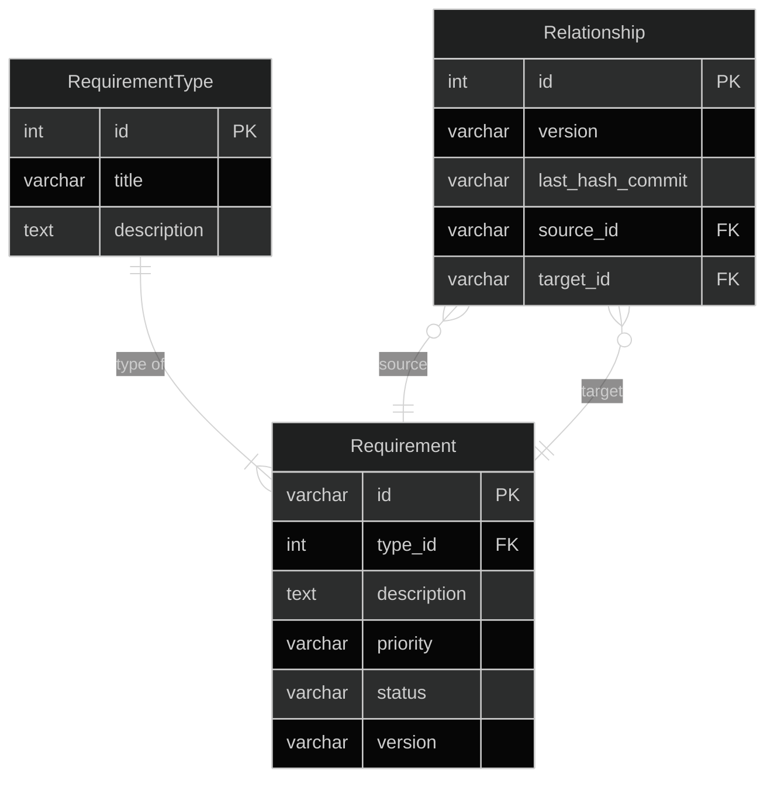

```mermaid
%%{init: {'theme':'dark'}}%%
erDiagram
    RequirementType ||--|{ Requirement : "type of"
    RequirementType {
	    int id PK
        varchar title
        text description
    }
	Requirement {
		varchar id PK
		int type_id FK
		text description 
		varchar priority
		varchar status
		varchar version
	}
    Relationship {
	    int id PK
	    varchar version 
	    varchar last_hash_commit
	    varchar source_id FK
	    varchar target_id FK
    }
    Relationship }o--|| Requirement : "source"
    Relationship }o--|| Requirement : "target"
```
